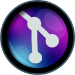
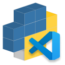

# Credits

Thanks for this awesome tools !

## Tools

### Vscode

### Git and Github

### Python

## Vscode extensions

### Microsoft - Python extension

### pKief - material icon theme

### Aaron Bond - Better Comments

### GitKraken - GitLens

### slightc - Pip Manager

### CoenraadS - Bracket Pair Colorizer

